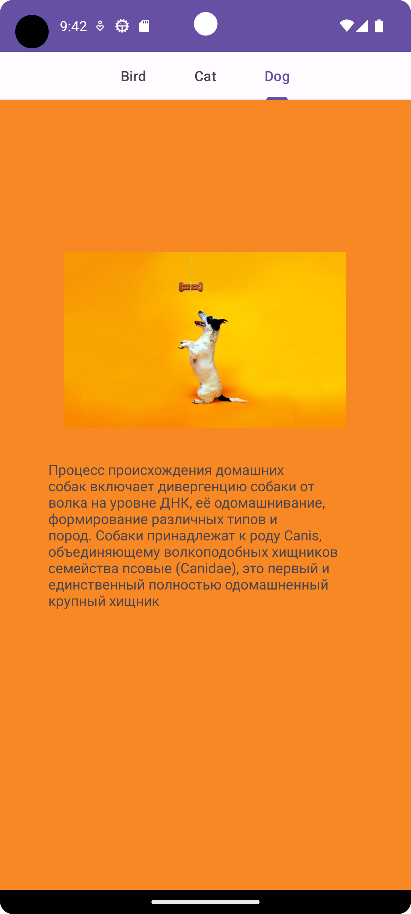
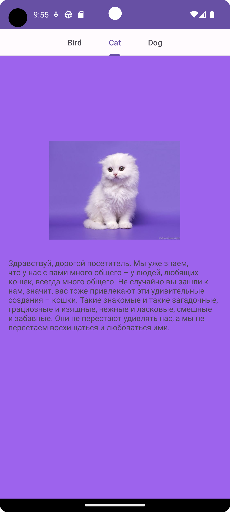
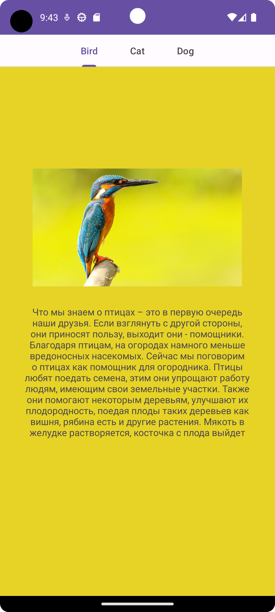

# Tab Layout App

The simple app what demonstrates how works tab layout. There are three tabs, each of them
is open appropriate fragment. You need just tap on either of tab if you want to see how it works.

## Screenshots of tabs
<code></code>
<code></code>
<code></code>